# Complete Development Guide

**Node.js + PostgreSQL + Docker Starter**  
How to Work on This Repository

---

##  Table of Contents

1. [Migrations: How to Run and Create Them](#1-migrations-how-to-run-and-create-them)
2. [Adding New API Endpoints](#2-adding-new-api-endpoints)
3. [Models and Relations](#3-models-and-relations)
4. [Connecting Controllers with Models](#4-connecting-controllers-with-models)
5. [Authorization and Authentication](#5-authorization-and-authentication)
6. [Background Jobs with BullMQ](#6-background-jobs-with-bullmq)
7. [Model Methods: Class vs Instance](#7-model-methods-class-vs-instance)
8. [Quick Reference](#8-quick-reference)

---

## 1. Migrations: How to Run and Create Them

### What are Migrations?

Migrations are database version control. Each migration file creates or modifies database tables.

**How migrations work:**
- Each migration has an `up()` function (apply changes) and `down()` function (revert changes)
- Sequelize tracks executed migrations in the `SequelizeMeta` table
- Migrations run in order based on their timestamp prefix

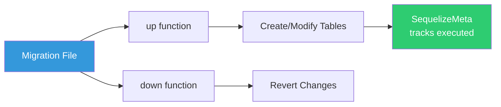

### Running Migrations

```bash
# Run all pending migrations
npm run migrate

# Undo last migration
npm run migrate:undo

# In Docker
docker-compose exec app npm run migrate
```

### Creating a New Migration

**Step 1: Generate migration and model**

```bash
npx sequelize-cli model:generate \
  --name Post \
  --attributes title:string,content:text,userId:integer
```

This creates:
- `migrations/XXXXXX-create-post.js` (migration file)
- `src/models/post.js` (model file - you'll customize this)

**Step 2: Edit the migration file**

```javascript
// migrations/XXXXXX-create-post.js

module.exports = {
  async up(queryInterface, Sequelize) {
    await queryInterface.createTable('posts', {
      id: {
        type: Sequelize.INTEGER,
        autoIncrement: true,
        primaryKey: true,
        allowNull: false
      },
      title: {
        type: Sequelize.STRING,
        allowNull: false
      },
      content: {
        type: Sequelize.TEXT,
        allowNull: false
      },
      userId: {
        type: Sequelize.INTEGER,
        allowNull: false,
        references: {
          model: 'users',      // Foreign key to users table
          key: 'id'
        },
        onUpdate: 'CASCADE',   // Update post if user id changes
        onDelete: 'CASCADE'    // Delete post if user is deleted
      },
      createdAt: {
        type: Sequelize.DATE,
        allowNull: false,
        defaultValue: Sequelize.literal('CURRENT_TIMESTAMP')
      },
      updatedAt: {
        type: Sequelize.DATE,
        allowNull: false,
        defaultValue: Sequelize.literal('CURRENT_TIMESTAMP')
      }
    });
    
    // Add indexes for better query performance
    await queryInterface.addIndex('posts', ['userId']);
    await queryInterface.addIndex('posts', ['createdAt']);
  },

  async down(queryInterface, Sequelize) {
    await queryInterface.dropTable('posts');
  }
};
```

**Step 3: Run the migration**

```bash
npm run migrate
```

### Common Migration Operations

#### Add a column

```bash
npx sequelize-cli migration:generate --name add-status-to-posts
```

```javascript
module.exports = {
  async up(queryInterface, Sequelize) {
    await queryInterface.addColumn('posts', 'status', {
      type: Sequelize.STRING,
      allowNull: false,
      defaultValue: 'draft'
    });
  },

  async down(queryInterface, Sequelize) {
    await queryInterface.removeColumn('posts', 'status');
  }
};
```

#### Remove a column

```javascript
module.exports = {
  async up(queryInterface, Sequelize) {
    await queryInterface.removeColumn('posts', 'status');
  },

  async down(queryInterface, Sequelize) {
    await queryInterface.addColumn('posts', 'status', {
      type: Sequelize.STRING
    });
  }
};
```

#### Add an index

```javascript
module.exports = {
  async up(queryInterface, Sequelize) {
    await queryInterface.addIndex('posts', ['status', 'createdAt']);
  },

  async down(queryInterface, Sequelize) {
    await queryInterface.removeIndex('posts', ['status', 'createdAt']);
  }
};
```

---

## 2. Adding New API Endpoints

### The Request Flow

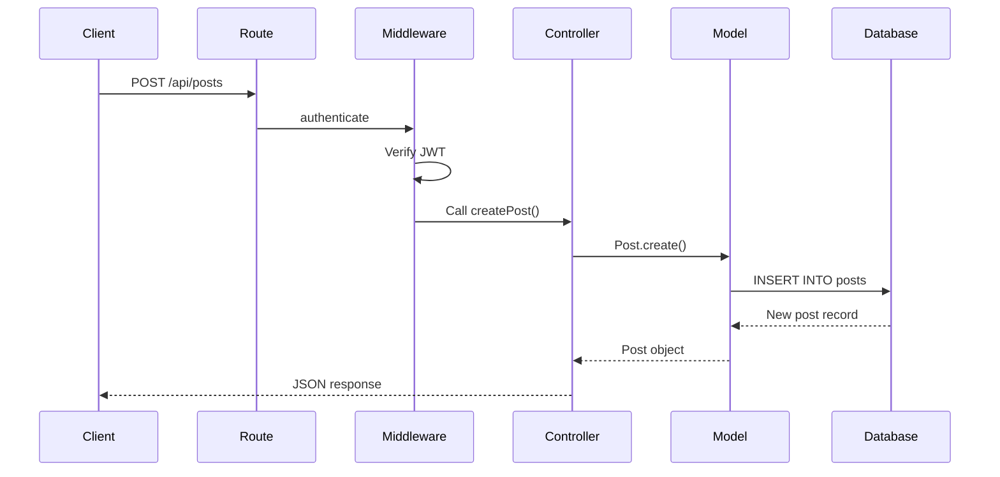

To add a new endpoint, you need to create/update 3 files:
1. **Controller** - Contains business logic
2. **Route** - Defines endpoint and validation
3. **App** - Mounts the route

### Step 1: Create Controller

```javascript
// src/controllers/postController.js

const { Post, User } = require('../models');

// GET /api/posts - Get all posts
const getAllPosts = async (req, res) => {
  try {
    const posts = await Post.findAll({
      include: [{ 
        model: User, 
        as: 'author',
        attributes: ['id', 'firstName', 'lastName']
      }],
      order: [['createdAt', 'DESC']],
      limit: 20
    });
    
    res.json({ posts });
  } catch (error) {
    console.error('Get posts error:', error);
    res.status(500).json({ error: 'Failed to get posts' });
  }
};

// POST /api/posts - Create new post
const createPost = async (req, res) => {
  try {
    const { title, content } = req.body;
    
    const post = await Post.create({
      title,
      content,
      userId: req.user.id  // From authenticate middleware
    });
    
    res.status(201).json({ post });
  } catch (error) {
    console.error('Create post error:', error);
    res.status(500).json({ error: 'Failed to create post' });
  }
};

// GET /api/posts/:id - Get single post
const getPost = async (req, res) => {
  try {
    const { id } = req.params;
    
    const post = await Post.findByPk(id, {
      include: [{ model: User, as: 'author' }]
    });
    
    if (!post) {
      return res.status(404).json({ error: 'Post not found' });
    }
    
    res.json({ post });
  } catch (error) {
    console.error('Get post error:', error);
    res.status(500).json({ error: 'Failed to get post' });
  }
};

// PUT /api/posts/:id - Update post
const updatePost = async (req, res) => {
  try {
    const { id } = req.params;
    const { title, content } = req.body;
    
    const post = await Post.findByPk(id);
    
    if (!post) {
      return res.status(404).json({ error: 'Post not found' });
    }
    
    // Check authorization
    if (post.userId !== req.user.id) {
      return res.status(403).json({ error: 'Not authorized' });
    }
    
    await post.update({ title, content });
    res.json({ post });
  } catch (error) {
    console.error('Update post error:', error);
    res.status(500).json({ error: 'Failed to update post' });
  }
};

// DELETE /api/posts/:id - Delete post
const deletePost = async (req, res) => {
  try {
    const { id } = req.params;
    
    const post = await Post.findByPk(id);
    
    if (!post) {
      return res.status(404).json({ error: 'Post not found' });
    }
    
    // Check authorization
    if (post.userId !== req.user.id) {
      return res.status(403).json({ error: 'Not authorized' });
    }
    
    await post.destroy();
    res.json({ message: 'Post deleted successfully' });
  } catch (error) {
    console.error('Delete post error:', error);
    res.status(500).json({ error: 'Failed to delete post' });
  }
};

module.exports = {
  getAllPosts,
  getPost,
  createPost,
  updatePost,
  deletePost
};
```

### Step 2: Create Route

```javascript
// src/routes/post.js

const express = require('express');
const { body } = require('express-validator');
const { 
  getAllPosts, 
  getPost, 
  createPost, 
  updatePost, 
  deletePost 
} = require('../controllers/postController');
const { authenticate } = require('../middleware/auth');
const { validate } = require('../middleware/validator');

const router = express.Router();

// Public routes
router.get('/', getAllPosts);
router.get('/:id', getPost);

// Protected routes (require authentication)
router.post(
  '/',
  authenticate,
  [
    body('title').trim().notEmpty().withMessage('Title is required'),
    body('content').trim().notEmpty().withMessage('Content is required'),
    validate
  ],
  createPost
);

router.put(
  '/:id',
  authenticate,
  [
    body('title').optional().trim().notEmpty(),
    body('content').optional().trim().notEmpty(),
    validate
  ],
  updatePost
);

router.delete('/:id', authenticate, deletePost);

module.exports = router;
```

### Step 3: Mount Route in App

```javascript
// src/app.js

const express = require('express');
const authRoutes = require('./routes/auth');
const postRoutes = require('./routes/post');  // Import route

const app = express();

// Middleware
app.use(express.json());

// Mount routes
app.use('/api/auth', authRoutes);
app.use('/api/posts', postRoutes);  // Mount route

module.exports = app;
```

---

## 3. Models and Relations

### Understanding Relations

There are three main types of database relationships:

### 3.1 One-to-Many Relationship

**Example:** One user has many posts, one post belongs to one user.

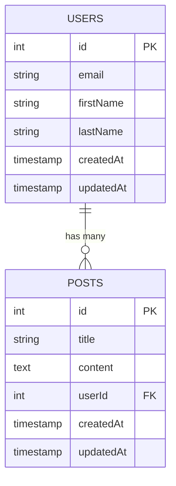

**Migration:**

```javascript
// migrations/XXXXXX-create-post.js

module.exports = {
  async up(queryInterface, Sequelize) {
    await queryInterface.createTable('posts', {
      id: {
        type: Sequelize.INTEGER,
        autoIncrement: true,
        primaryKey: true
      },
      title: {
        type: Sequelize.STRING,
        allowNull: false
      },
      content: {
        type: Sequelize.TEXT,
        allowNull: false
      },
      userId: {
        type: Sequelize.INTEGER,
        allowNull: false,
        references: {
          model: 'users',    // Reference users table
          key: 'id'          // Reference id column
        },
        onUpdate: 'CASCADE', // If user id changes, update posts
        onDelete: 'CASCADE'  // If user deleted, delete their posts
      },
      createdAt: {
        type: Sequelize.DATE,
        allowNull: false
      },
      updatedAt: {
        type: Sequelize.DATE,
        allowNull: false
      }
    });
    
    // Add index on foreign key for faster queries
    await queryInterface.addIndex('posts', ['userId']);
  },
  
  async down(queryInterface) {
    await queryInterface.dropTable('posts');
  }
};
```

**Model Definition:**

```javascript
// src/models/Post.js

const { DataTypes } = require('sequelize');
const sequelize = require('../config/database');

const Post = sequelize.define('Post', {
  id: {
    type: DataTypes.INTEGER,
    autoIncrement: true,
    primaryKey: true
  },
  title: {
    type: DataTypes.STRING,
    allowNull: false
  },
  content: {
    type: DataTypes.TEXT,
    allowNull: false
  },
  userId: {
    type: DataTypes.INTEGER,
    allowNull: false
  }
}, {
  tableName: 'posts',
  timestamps: true
});

// Define associations in src/models/index.js
// Post.belongsTo(User, { foreignKey: 'userId', as: 'author' });
// User.hasMany(Post, { foreignKey: 'userId', as: 'posts' });

module.exports = Post;
```

**Usage:**

```javascript
// Get post with author
const post = await Post.findByPk(1, {
  include: [{ model: User, as: 'author' }]
});

console.log(post.title);           // "My Post"
console.log(post.author.firstName); // "John"

// Get user with all posts
const user = await User.findByPk(1, {
  include: [{ model: Post, as: 'posts' }]
});

console.log(user.firstName);     // "John"
console.log(user.posts.length);  // 5
console.log(user.posts[0].title); // "First Post"
```

### 3.2 Many-to-Many Relationship

**Example:** Posts can have many tags, tags can belong to many posts (requires junction table).

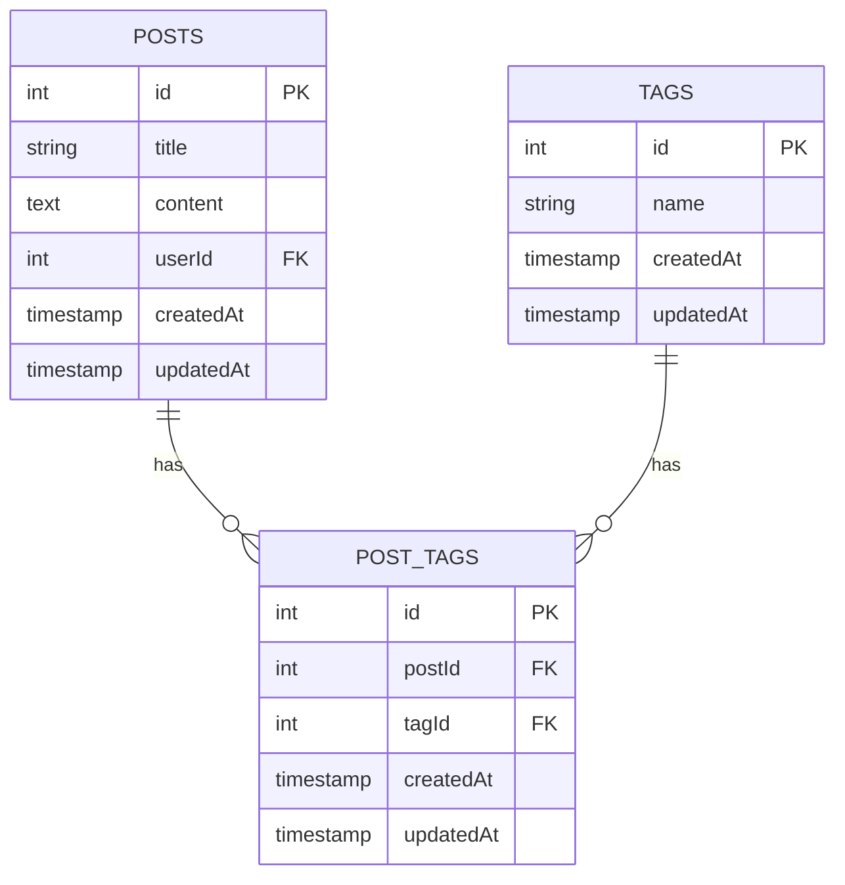

**Migrations:**

```javascript
// migrations/XXXXXX-create-tag.js

module.exports = {
  async up(queryInterface, Sequelize) {
    await queryInterface.createTable('tags', {
      id: {
        type: Sequelize.INTEGER,
        autoIncrement: true,
        primaryKey: true
      },
      name: {
        type: Sequelize.STRING,
        allowNull: false,
        unique: true
      },
      createdAt: Sequelize.DATE,
      updatedAt: Sequelize.DATE
    });
  },
  
  async down(queryInterface) {
    await queryInterface.dropTable('tags');
  }
};

// migrations/XXXXXX-create-post-tags.js

module.exports = {
  async up(queryInterface, Sequelize) {
    await queryInterface.createTable('post_tags', {
      id: {
        type: Sequelize.INTEGER,
        autoIncrement: true,
        primaryKey: true
      },
      postId: {
        type: Sequelize.INTEGER,
        allowNull: false,
        references: {
          model: 'posts',
          key: 'id'
        },
        onUpdate: 'CASCADE',
        onDelete: 'CASCADE'
      },
      tagId: {
        type: Sequelize.INTEGER,
        allowNull: false,
        references: {
          model: 'tags',
          key: 'id'
        },
        onUpdate: 'CASCADE',
        onDelete: 'CASCADE'
      },
      createdAt: Sequelize.DATE,
      updatedAt: Sequelize.DATE
    });
    
    // Composite unique index (prevent duplicate post-tag pairs)
    await queryInterface.addIndex('post_tags', ['postId', 'tagId'], {
      unique: true,
      name: 'post_tags_unique'
    });
    
    // Individual indexes for foreign keys
    await queryInterface.addIndex('post_tags', ['postId']);
    await queryInterface.addIndex('post_tags', ['tagId']);
  },
  
  async down(queryInterface) {
    await queryInterface.dropTable('post_tags');
  }
};
```

**Model Definition:**

```javascript
// src/models/Tag.js

const { DataTypes } = require('sequelize');
const sequelize = require('../config/database');

const Tag = sequelize.define('Tag', {
  id: {
    type: DataTypes.INTEGER,
    autoIncrement: true,
    primaryKey: true
  },
  name: {
    type: DataTypes.STRING,
    allowNull: false,
    unique: true
  }
}, {
  tableName: 'tags',
  timestamps: true
});

// Define associations in src/models/index.js
// Post.belongsToMany(Tag, { through: 'post_tags', foreignKey: 'postId', as: 'tags' });
// Tag.belongsToMany(Post, { through: 'post_tags', foreignKey: 'tagId', as: 'posts' });

module.exports = Tag;
```

**Usage:**

```javascript
// Get post with tags
const post = await Post.findByPk(1, {
  include: [{ model: Tag, as: 'tags' }]
});

console.log(post.title);         // "My Post"
console.log(post.tags.length);   // 3
console.log(post.tags[0].name);  // "Tech"

// Add tags to post (magic methods from belongsToMany)
const post = await Post.findByPk(1);
const tags = await Tag.findAll({
  where: { name: ['Tech', 'Tutorial'] }
});

await post.addTags(tags);        // Add multiple tags
await post.addTag(singleTag);    // Add single tag
await post.removeTag(tag);       // Remove a tag
await post.setTags([tag1, tag2]); // Replace all tags
await post.getTags();            // Get all tags

// Check if post has tag
const hasTag = await post.hasTags([techTag]);
```

### 3.3 One-to-One Relationship

**Example:** One user has one profile.

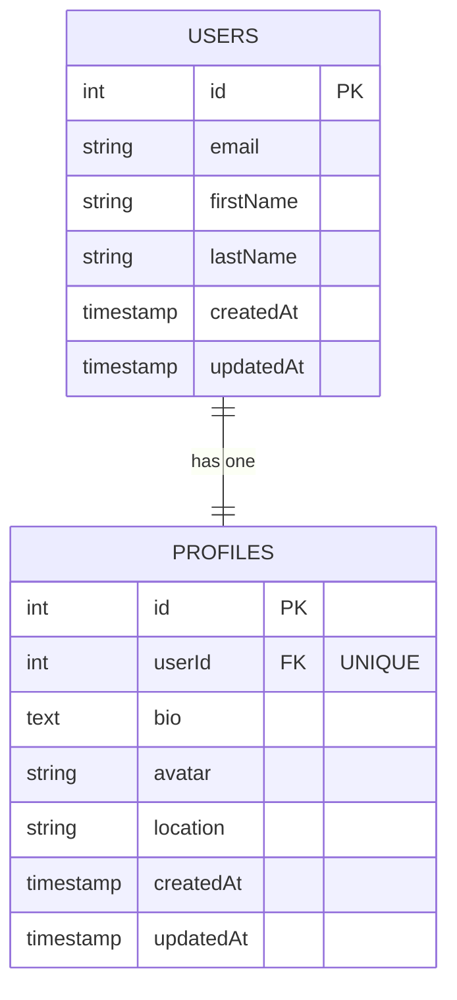

**Migration:**

```javascript
// migrations/XXXXXX-create-profile.js

module.exports = {
  async up(queryInterface, Sequelize) {
    await queryInterface.createTable('profiles', {
      id: {
        type: Sequelize.INTEGER,
        autoIncrement: true,
        primaryKey: true
      },
      userId: {
        type: Sequelize.INTEGER,
        allowNull: false,
        unique: true,          // ← UNIQUE makes it one-to-one!
        references: {
          model: 'users',
          key: 'id'
        },
        onUpdate: 'CASCADE',
        onDelete: 'CASCADE'
      },
      bio: {
        type: Sequelize.TEXT,
        allowNull: true
      },
      avatar: {
        type: Sequelize.STRING,
        allowNull: true
      },
      location: {
        type: Sequelize.STRING,
        allowNull: true
      },
      createdAt: Sequelize.DATE,
      updatedAt: Sequelize.DATE
    });
    
    // Enforce one-to-one relationship
    await queryInterface.addIndex('profiles', ['userId'], {
      unique: true
    });
  },
  
  async down(queryInterface) {
    await queryInterface.dropTable('profiles');
  }
};
```

**Model Definition:**

```javascript
// src/models/Profile.js

const { DataTypes } = require('sequelize');
const sequelize = require('../config/database');

const Profile = sequelize.define('Profile', {
  id: {
    type: DataTypes.INTEGER,
    autoIncrement: true,
    primaryKey: true
  },
  userId: {
    type: DataTypes.INTEGER,
    allowNull: false,
    unique: true  // Enforces one-to-one
  },
  bio: {
    type: DataTypes.TEXT,
    allowNull: true
  },
  avatar: {
    type: DataTypes.STRING,
    allowNull: true
  },
  location: {
    type: DataTypes.STRING,
    allowNull: true
  }
}, {
  tableName: 'profiles',
  timestamps: true
});

// Define associations in src/models/index.js
// User.hasOne(Profile, { foreignKey: 'userId', as: 'profile' });
// Profile.belongsTo(User, { foreignKey: 'userId', as: 'user' });

module.exports = Profile;
```

**Usage:**

```javascript
// Get user with profile
const user = await User.findByPk(1, {
  include: [{ model: Profile, as: 'profile' }]
});

console.log(user.firstName);        // "John"
console.log(user.profile.bio);      // "Software Developer"
console.log(user.profile.location); // "San Francisco"

// Create profile for user
const user = await User.findByPk(1);
const profile = await Profile.create({
  userId: user.id,
  bio: 'Software Developer',
  location: 'San Francisco'
});

// Or use association method
await user.createProfile({
  bio: 'Software Developer',
  location: 'San Francisco'
});
```

---

## 4. Connecting Controllers with Models

### Request Flow Summary

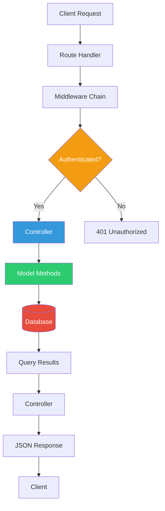

### Complete CRUD Controller Example

```javascript
// src/controllers/postController.js

const { Post, User, Tag } = require('../models');
const { Op } = require('sequelize');

// CREATE - Create new post
const createPost = async (req, res) => {
  try {
    const { title, content, tagNames } = req.body;
    
    // 1. Create post
    const post = await Post.create({
      title,
      content,
      userId: req.user.id  // From authenticate middleware
    });
    
    // 2. Handle tags (if provided)
    if (tagNames && tagNames.length > 0) {
      // findOrCreate returns [instance, created]
      const tagPromises = tagNames.map(name =>
        Tag.findOrCreate({ where: { name } })
      );
      const tagResults = await Promise.all(tagPromises);
      const tags = tagResults.map(([tag]) => tag);
      
      // Add tags to post (many-to-many magic method)
      await post.addTags(tags);
    }
    
    // 3. Reload with associations
    await post.reload({
      include: [
        { model: User, as: 'author', attributes: ['id', 'firstName', 'lastName'] },
        { model: Tag, as: 'tags', attributes: ['id', 'name'] }
      ]
    });
    
    res.status(201).json({ 
      success: true,
      post 
    });
  } catch (error) {
    console.error('Create post error:', error);
    res.status(500).json({ 
      success: false,
      error: 'Failed to create post' 
    });
  }
};

// READ - Get all posts with filters and pagination
const getAllPosts = async (req, res) => {
  try {
    // Extract query parameters
    const { 
      page = 1, 
      limit = 10, 
      search = '', 
      userId,
      tag 
    } = req.query;
    
    const offset = (page - 1) * limit;
    
    // Build WHERE clause
    const where = {};
    
    // Search in title or content
    if (search) {
      where[Op.or] = [
        { title: { [Op.iLike]: `%${search}%` } },
        { content: { [Op.iLike]: `%${search}%` } }
      ];
    }
    
    // Filter by user
    if (userId) {
      where.userId = userId;
    }
    
    // Build include clause
    const include = [
      { 
        model: User, 
        as: 'author',
        attributes: ['id', 'firstName', 'lastName']
      },
      { 
        model: Tag, 
        as: 'tags',
        attributes: ['id', 'name']
      }
    ];
    
    // Filter by tag
    if (tag) {
      include[1].where = { name: tag };
    }
    
    // Execute query with count
    const { count, rows: posts } = await Post.findAndCountAll({
      where,
      include,
      order: [['createdAt', 'DESC']],
      limit: parseInt(limit),
      offset: parseInt(offset),
      distinct: true  // Important for many-to-many joins
    });
    
    res.json({
      success: true,
      posts,
      pagination: {
        total: count,
        page: parseInt(page),
        limit: parseInt(limit),
        totalPages: Math.ceil(count / limit),
        hasMore: offset + posts.length < count
      }
    });
  } catch (error) {
    console.error('Get posts error:', error);
    res.status(500).json({ 
      success: false,
      error: 'Failed to get posts' 
    });
  }
};

// READ - Get single post
const getPost = async (req, res) => {
  try {
    const { id } = req.params;
    
    const post = await Post.findByPk(id, {
      include: [
        { 
          model: User, 
          as: 'author',
          attributes: ['id', 'firstName', 'lastName', 'email']
        },
        { 
          model: Tag, 
          as: 'tags',
          attributes: ['id', 'name']
        }
      ]
    });
    
    if (!post) {
      return res.status(404).json({ 
        success: false,
        error: 'Post not found' 
      });
    }
    
    res.json({ 
      success: true,
      post 
    });
  } catch (error) {
    console.error('Get post error:', error);
    res.status(500).json({ 
      success: false,
      error: 'Failed to get post' 
    });
  }
};

// UPDATE - Update post
const updatePost = async (req, res) => {
  try {
    const { id } = req.params;
    const { title, content, tagNames } = req.body;
    
    const post = await Post.findByPk(id);
    
    if (!post) {
      return res.status(404).json({ 
        success: false,
        error: 'Post not found' 
      });
    }
    
    // Check authorization
    if (post.userId !== req.user.id) {
      return res.status(403).json({ 
        success: false,
        error: 'Not authorized to update this post' 
      });
    }
    
    // Update post fields
    await post.update({ title, content });
    
    // Update tags if provided
    if (tagNames) {
      const tagPromises = tagNames.map(name =>
        Tag.findOrCreate({ where: { name } })
      );
      const tagResults = await Promise.all(tagPromises);
      const tags = tagResults.map(([tag]) => tag);
      
      // Replace all tags
      await post.setTags(tags);
    }
    
    // Reload with associations
    await post.reload({
      include: [
        { model: User, as: 'author' },
        { model: Tag, as: 'tags' }
      ]
    });
    
    res.json({ 
      success: true,
      post 
    });
  } catch (error) {
    console.error('Update post error:', error);
    res.status(500).json({ 
      success: false,
      error: 'Failed to update post' 
    });
  }
};

// DELETE - Delete post
const deletePost = async (req, res) => {
  try {
    const { id } = req.params;
    
    const post = await Post.findByPk(id);
    
    if (!post) {
      return res.status(404).json({ 
        success: false,
        error: 'Post not found' 
      });
    }
    
    // Check authorization
    if (post.userId !== req.user.id) {
      return res.status(403).json({ 
        success: false,
        error: 'Not authorized to delete this post' 
      });
    }
    
    // Delete post (associations deleted automatically with CASCADE)
    await post.destroy();
    
    res.json({ 
      success: true,
      message: 'Post deleted successfully' 
    });
  } catch (error) {
    console.error('Delete post error:', error);
    res.status(500).json({ 
      success: false,
      error: 'Failed to delete post' 
    });
  }
};

module.exports = {
  createPost,
  getAllPosts,
  getPost,
  updatePost,
  deletePost
};
```

---

## 5. Authorization and Authentication

### How Authentication Works

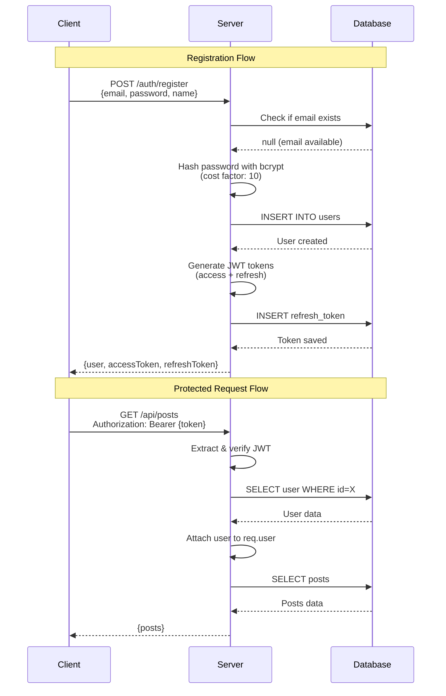

### JWT Token Structure

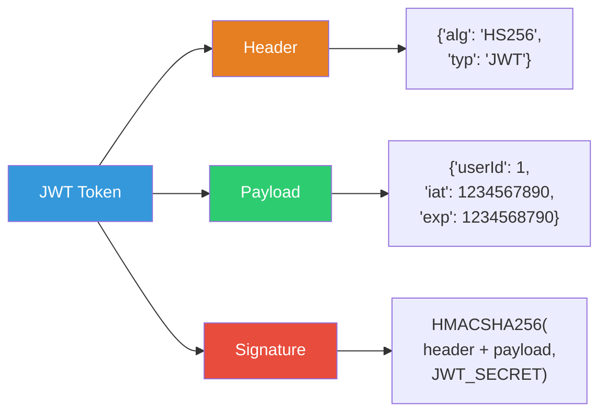

### Registration Implementation

```javascript
// src/controllers/authController.js

const bcrypt = require('bcryptjs');
const { User, RefreshToken } = require('../models');
const { generateAccessToken, generateRefreshToken } = require('../utils/jwt');

const register = async (req, res) => {
  try {
    const { email, password, firstName, lastName } = req.body;
    
    // 1. Check if email already exists
    const existingUser = await User.findOne({ where: { email } });
    
    if (existingUser) {
      return res.status(400).json({ 
        success: false,
        error: 'Email already registered' 
      });
    }
    
    // 2. Hash password (NEVER store plain passwords!)
    // Cost factor of 10 is a good balance between security and performance
    const hashedPassword = await bcrypt.hash(password, 10);
    
    // 3. Create user
    const user = await User.create({
      email,
      password: hashedPassword,
      firstName,
      lastName
    });
    
    // 4. Generate tokens
    const accessToken = generateAccessToken(user.id);
    const refreshToken = generateRefreshToken();
    
    // 5. Save refresh token to database
    const expiresAt = new Date();
    expiresAt.setDate(expiresAt.getDate() + 7); // 7 days
    
    await RefreshToken.create({
      token: refreshToken,
      userId: user.id,
      expiresAt
    });
    
    // 6. Remove password from response
    const userResponse = user.toJSON();
    delete userResponse.password;
    
    res.status(201).json({
      success: true,
      user: userResponse,
      accessToken,
      refreshToken
    });
  } catch (error) {
    console.error('Registration error:', error);
    res.status(500).json({ 
      success: false,
      error: 'Registration failed' 
    });
  }
};
```

### Login Implementation

```javascript
const login = async (req, res) => {
  try {
    const { email, password } = req.body;
    
    // 1. Find user by email
    const user = await User.findOne({ where: { email } });
    
    if (!user) {
      return res.status(401).json({ 
        success: false,
        error: 'Invalid email or password' 
      });
    }
    
    // 2. Verify password
    const isValidPassword = await bcrypt.compare(password, user.password);
    
    if (!isValidPassword) {
      return res.status(401).json({ 
        success: false,
        error: 'Invalid email or password' 
      });
    }
    
    // 3. Generate tokens
    const accessToken = generateAccessToken(user.id);
    const refreshToken = generateRefreshToken();
    
    // 4. Save refresh token
    const expiresAt = new Date();
    expiresAt.setDate(expiresAt.getDate() + 7);
    
    await RefreshToken.create({
      token: refreshToken,
      userId: user.id,
      expiresAt
    });
    
    // 5. Remove password from response
    const userResponse = user.toJSON();
    delete userResponse.password;
    
    res.json({
      success: true,
      user: userResponse,
      accessToken,
      refreshToken
    });
  } catch (error) {
    console.error('Login error:', error);
    res.status(500).json({ 
      success: false,
      error: 'Login failed' 
    });
  }
};

module.exports = {
  register,
  login
};
```

### Authentication Middleware

```javascript
// src/middleware/auth.js

const jwt = require('jsonwebtoken');
const { User } = require('../models');
const config = require('../config');

const authenticate = async (req, res, next) => {
  try {
    // 1. Get token from Authorization header
    // Format: "Bearer eyJhbGciOiJIUzI1NiIsInR5cCI6IkpXVCJ9..."
    const authHeader = req.headers.authorization;
    
    if (!authHeader || !authHeader.startsWith('Bearer ')) {
      return res.status(401).json({ 
        success: false,
        error: 'No token provided' 
      });
    }
    
    // 2. Extract token (remove "Bearer " prefix)
    const token = authHeader.substring(7);
    
    // 3. Verify JWT signature and decode payload
    let decoded;
    try {
      decoded = jwt.verify(token, config.jwt.secret);
    } catch (err) {
      if (err.name === 'TokenExpiredError') {
        return res.status(401).json({ 
          success: false,
          error: 'Token expired' 
        });
      }
      return res.status(401).json({ 
        success: false,
        error: 'Invalid token' 
      });
    }
    
    // 4. Find user from token payload
    const user = await User.findByPk(decoded.userId, {
      attributes: { exclude: ['password'] }  // Don't include password
    });
    
    if (!user) {
      return res.status(401).json({ 
        success: false,
        error: 'User not found' 
      });
    }
    
    // 5. Attach user to request object
    req.user = user;
    
    // 6. Continue to next middleware/handler
    next();
  } catch (error) {
    console.error('Authentication error:', error);
    res.status(401).json({ 
      success: false,
      error: 'Authentication failed' 
    });
  }
};

module.exports = { authenticate };
```

### JWT Utilities

```javascript
// src/utils/jwt.js

const jwt = require('jsonwebtoken');
const crypto = require('crypto');
const config = require('../config');

/**
 * Generate JWT access token
 * Expires in 15 minutes
 */
const generateAccessToken = (userId) => {
  return jwt.sign(
    { userId },                    // Payload (data stored in token)
    config.jwt.secret,             // Secret key for signing
    { expiresIn: config.jwt.expire } // Token expiration (15m)
  );
  
  // Returns: "eyJhbGciOiJIUzI1NiIsInR5cCI6IkpXVCJ9..."
  // Decoded payload: { userId: 1, iat: 1641206400, exp: 1641207300 }
};

/**
 * Generate random refresh token
 * Stored in database, expires in 7 days
 */
const generateRefreshToken = () => {
  // Generate 40 random bytes, convert to hex string
  return crypto.randomBytes(40).toString('hex');
  
  // Returns: "a1b2c3d4e5f6..."
};

/**
 * Verify JWT access token
 * Returns decoded payload or null if invalid
 */
const verifyAccessToken = (token) => {
  try {
    const decoded = jwt.verify(token, config.jwt.secret);
    // Returns: { userId: 1, iat: 1641206400, exp: 1641207300 }
    return decoded;
  } catch (error) {
    // Token is invalid, expired, or malformed
    return null;
  }
};

module.exports = {
  generateAccessToken,
  generateRefreshToken,
  verifyAccessToken
};
```

### Token Refresh Implementation

```javascript
// src/controllers/authController.js

const refreshAccessToken = async (req, res) => {
  try {
    const { refreshToken } = req.body;
    
    if (!refreshToken) {
      return res.status(400).json({ 
        success: false,
        error: 'Refresh token required' 
      });
    }
    
    // 1. Find refresh token in database
    const tokenRecord = await RefreshToken.findOne({
      where: { token: refreshToken }
    });
    
    if (!tokenRecord) {
      return res.status(401).json({ 
        success: false,
        error: 'Invalid refresh token' 
      });
    }
    
    // 2. Check if token is expired
    if (new Date() > tokenRecord.expiresAt) {
      // Delete expired token
      await tokenRecord.destroy();
      return res.status(401).json({ 
        success: false,
        error: 'Refresh token expired' 
      });
    }
    
    // 3. Generate new access token
    const accessToken = generateAccessToken(tokenRecord.userId);
    
    res.json({
      success: true,
      accessToken
    });
  } catch (error) {
    console.error('Token refresh error:', error);
    res.status(500).json({ 
      success: false,
      error: 'Token refresh failed' 
    });
  }
};
```

---

## 6. Background Jobs with BullMQ

### How Background Jobs Work

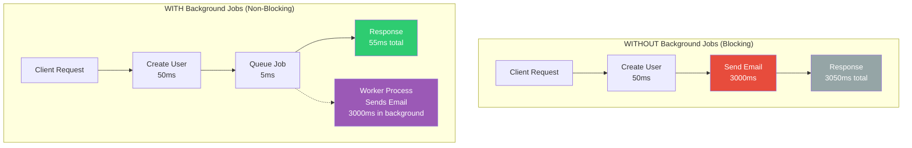

**Key Benefits:**
- **Fast Response Times**: User gets immediate response (55ms vs 3050ms)
- **Better UX**: User doesn't wait for slow operations
- **Reliability**: Jobs are retried automatically on failure
- **Scalability**: Workers can run on separate servers
- **Monitoring**: Track job status, failures, and performance

### Job Lifecycle States

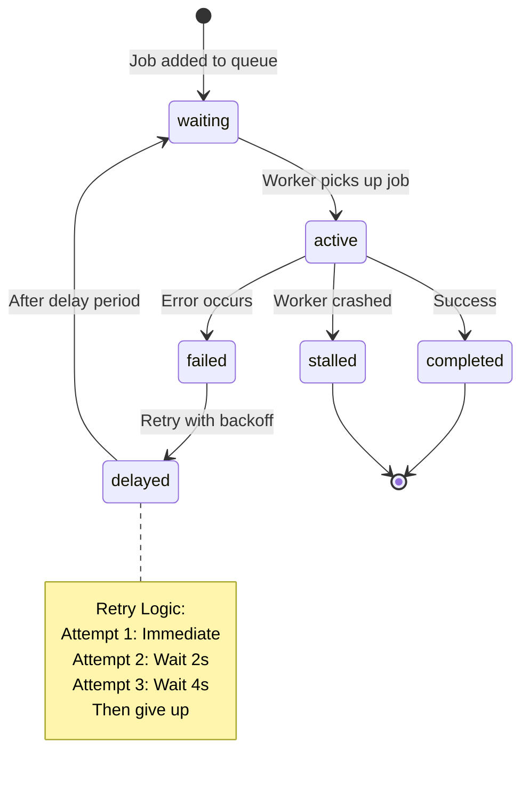

### Setting Up Background Jobs

#### Step 1: Install Dependencies

```bash
npm install bullmq ioredis
```

#### Step 2: Define Job

```javascript
// src/jobs/emailJob.js

const { Queue, Worker } = require('bullmq');
const Redis = require('ioredis');
const config = require('../config');

// Connect to Redis
const connection = new Redis({
  host: config.redis.host,
  port: config.redis.port,
  maxRetriesPerRequest: null,
  enableReadyCheck: false
});

// Create queue
const emailQueue = new Queue('email', { connection });

// Create worker to process jobs
const emailWorker = new Worker(
  'email',  // Queue name
  async (job) => {
    // This function processes each job
    console.log(`Processing job ${job.id} - ${job.name}`);
    console.log('Job data:', job.data);
    
    const { to, subject, body, template } = job.data;
    
    // Send email (replace with actual email service)
    console.log(`Sending email to ${to}`);
    console.log(`Subject: ${subject}`);
    
    // Simulate email sending
    await sendEmail(to, subject, body, template);
    
    // Return result (optional, stored in Redis)
    return { 
      success: true, 
      sentAt: new Date(),
      to,
      subject
    };
  },
  { 
    connection,
    
    // Worker options
    concurrency: 5,  // Process 5 jobs simultaneously
    
    // Rate limiting
    limiter: {
      max: 10,       // Max 10 jobs
      duration: 1000 // Per 1 second
    }
  }
);

// Event handlers for monitoring
emailWorker.on('completed', (job, result) => {
  console.log(`✓ Job ${job.id} completed successfully`);
  console.log('Result:', result);
});

emailWorker.on('failed', (job, err) => {
  console.log(`✗ Job ${job.id} failed`);
  console.error('Error:', err.message);
});

emailWorker.on('progress', (job, progress) => {
  console.log(`Job ${job.id} progress: ${progress}%`);
});

emailWorker.on('stalled', (jobId) => {
  console.log(`Job ${jobId} stalled (worker crashed)`);
});

// Helper function to add jobs to queue
const addEmailJob = async (data, options = {}) => {
  return await emailQueue.add('send-email', data, {
    // Retry options
    attempts: 3,           // Retry up to 3 times
    backoff: {
      type: 'exponential', // Wait longer between each retry
      delay: 2000          // Start with 2 second delay
    },
    
    // Remove job after completion
    removeOnComplete: {
      age: 3600,   // Keep completed jobs for 1 hour
      count: 100   // Keep max 100 completed jobs
    },
    
    // Remove job after failure
    removeOnFail: {
      age: 24 * 3600 // Keep failed jobs for 24 hours
    },
    
    // Custom options
    ...options
  });
};

// Add priority job
const addUrgentEmailJob = async (data) => {
  return await addEmailJob(data, {
    priority: 1  // Higher priority (lower number = higher priority)
  });
};

// Add delayed job
const addScheduledEmailJob = async (data, delayMs) => {
  return await addEmailJob(data, {
    delay: delayMs  // Delay in milliseconds
  });
};

// Mock email sending function
const sendEmail = async (to, subject, body, template) => {
  // Replace with actual email service (SendGrid, AWS SES, etc.)
  await new Promise(resolve => setTimeout(resolve, 1000));
  console.log('Email sent successfully');
};

module.exports = {
  emailQueue,
  emailWorker,
  addEmailJob,
  addUrgentEmailJob,
  addScheduledEmailJob
};
```

#### Step 3: Start Worker Process

```javascript
// src/worker.js

require('dotenv').config();
const { emailWorker } = require('./jobs/emailJob');

console.log('========================================');
console.log('✓ Background workers started');
console.log('✓ Email worker listening for jobs...');
console.log('========================================');

// Graceful shutdown
process.on('SIGTERM', async () => {
  console.log('SIGTERM received, closing workers...');
  await emailWorker.close();
  process.exit(0);
});

process.on('SIGINT', async () => {
  console.log('SIGINT received, closing workers...');
  await emailWorker.close();
  process.exit(0);
});

// Keep process running
process.on('unhandledRejection', (err) => {
  console.error('Unhandled rejection:', err);
});
```

Add to `package.json`:

```json
{
  "scripts": {
    "worker": "node src/worker.js",
    "worker:dev": "nodemon src/worker.js"
  }
}
```

#### Step 4: Use in Controller

```javascript
// src/controllers/authController.js

const { addEmailJob, addScheduledEmailJob } = require('../jobs/emailJob');

const register = async (req, res) => {
  try {
    // ... create user ...
    
    // Queue immediate welcome email (don't wait for it)
    await addEmailJob({
      to: user.email,
      subject: 'Welcome to Our App!',
      body: `Hi ${user.firstName}, thanks for signing up!`,
      template: 'welcome'
    });
    
    // Queue follow-up email for 24 hours later
    await addScheduledEmailJob({
      to: user.email,
      subject: 'Getting Started Guide',
      body: 'Here are some tips to get started...',
      template: 'onboarding'
    }, 24 * 60 * 60 * 1000); // 24 hours in milliseconds
    
    // Return response immediately (don't wait for emails)
    res.status(201).json({ 
      success: true,
      user, 
      accessToken, 
      refreshToken 
    });
  } catch (error) {
    res.status(500).json({ 
      success: false,
      error: 'Registration failed' 
    });
  }
};
```

### Advanced Job Features

#### Progress Tracking

```javascript
const emailWorker = new Worker(
  'email',
  async (job) => {
    // Report progress
    await job.updateProgress(0);
    
    // Step 1: Validate email
    await validateEmail(job.data.to);
    await job.updateProgress(33);
    
    // Step 2: Render template
    const html = await renderTemplate(job.data.template, job.data.data);
    await job.updateProgress(66);
    
    // Step 3: Send email
    await sendEmail(job.data.to, html);
    await job.updateProgress(100);
    
    return { success: true };
  },
  { connection }
);
```

#### Job Dependencies

```javascript
// Send welcome email after user is created
const userJob = await userQueue.add('create-user', userData);

// This job waits for userJob to complete
await emailQueue.add(
  'welcome-email', 
  { userId: userData.id },
  { 
    parent: {
      id: userJob.id,
      queue: userQueue.name
    }
  }
);
```

#### Repeatable Jobs (Cron)

```javascript
// Send daily summary email at 9 AM
await emailQueue.add(
  'daily-summary',
  { type: 'summary' },
  {
    repeat: {
      pattern: '0 9 * * *',  // Cron expression: every day at 9 AM
      tz: 'America/New_York'
    }
  }
);

// Send weekly report every Monday
await emailQueue.add(
  'weekly-report',
  { type: 'report' },
  {
    repeat: {
      pattern: '0 10 * * 1'  // Every Monday at 10 AM
    }
  }
);
```

### Monitoring Jobs

```javascript
// Get job status
const job = await emailQueue.getJob(jobId);
console.log(job.state);  // 'waiting', 'active', 'completed', 'failed'

// Get queue stats
const counts = await emailQueue.getJobCounts();
console.log(counts);
// { waiting: 5, active: 2, completed: 100, failed: 3 }

// Get all jobs
const waitingJobs = await emailQueue.getWaiting();
const failedJobs = await emailQueue.getFailed();
const completedJobs = await emailQueue.getCompleted();

// Clean old jobs
await emailQueue.clean(24 * 3600 * 1000, 100, 'completed');  // Clean completed jobs older than 24h
```

---

## 7. Model Methods: Class vs Instance

### Understanding Model Methods

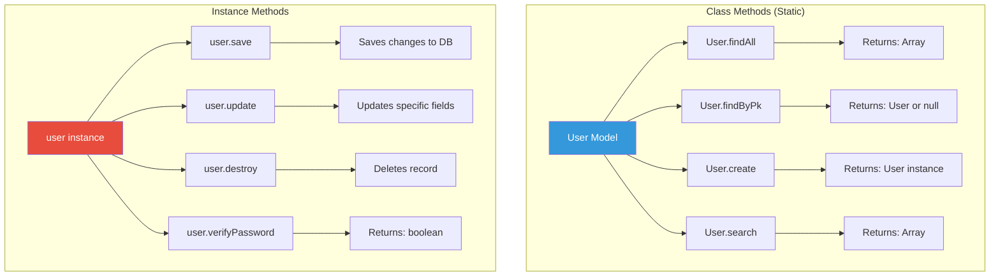

### Model with Both Method Types

```javascript
// src/models/User.js

const { DataTypes } = require('sequelize');
const sequelize = require('../config/database');
const bcrypt = require('bcryptjs');

const User = sequelize.define('User', {
  id: {
    type: DataTypes.INTEGER,
    autoIncrement: true,
    primaryKey: true
  },
  email: {
    type: DataTypes.STRING,
    allowNull: false,
    unique: true,
    validate: {
      isEmail: true
    }
  },
  password: {
    type: DataTypes.STRING,
    allowNull: false
  },
  firstName: {
    type: DataTypes.STRING,
    allowNull: false
  },
  lastName: {
    type: DataTypes.STRING,
    allowNull: false
  },
  role: {
    type: DataTypes.ENUM('user', 'admin', 'moderator'),
    defaultValue: 'user'
  },
  isActive: {
    type: DataTypes.BOOLEAN,
    defaultValue: true
  },
  lastLoginAt: {
    type: DataTypes.DATE,
    allowNull: true
  }
}, {
  tableName: 'users',
  timestamps: true,
  
  // Hooks
  hooks: {
    beforeCreate: async (user) => {
      if (user.password) {
        user.password = await bcrypt.hash(user.password, 10);
      }
    },
    beforeUpdate: async (user) => {
      if (user.changed('password')) {
        user.password = await bcrypt.hash(user.password, 10);
      }
    }
  }
});

// ==========================================
// CLASS METHODS (Static)
// Called on the Model: User.methodName()
// ==========================================

/**
 * Find user by email (case-insensitive)
 */
User.findByEmail = async function(email) {
  return await this.findOne({ 
    where: { 
      email: email.toLowerCase() 
    } 
  });
};

/**
 * Get user statistics
 */
User.getStatistics = async function() {
  const [total, active, admins] = await Promise.all([
    this.count(),
    this.count({ where: { isActive: true } }),
    this.count({ where: { role: 'admin' } })
  ]);
  
  return { total, active, admins };
};

/**
 * Search users by name or email
 */
User.search = async function(query, limit = 10) {
  const { Op } = require('sequelize');
  
  return await this.findAll({
    where: {
      [Op.or]: [
        { firstName: { [Op.iLike]: `%${query}%` } },
        { lastName: { [Op.iLike]: `%${query}%` } },
        { email: { [Op.iLike]: `%${query}%` } }
      ]
    },
    attributes: { exclude: ['password'] },
    limit,
    order: [['firstName', 'ASC']]
  });
};

/**
 * Get active users created in the last N days
 */
User.getRecentUsers = async function(days = 7) {
  const { Op } = require('sequelize');
  const date = new Date();
  date.setDate(date.getDate() - days);
  
  return await this.findAll({
    where: {
      isActive: true,
      createdAt: { [Op.gte]: date }
    },
    attributes: { exclude: ['password'] },
    order: [['createdAt', 'DESC']]
  });
};

/**
 * Bulk create users (useful for seeding)
 */
User.bulkCreate = async function(users) {
  return await this.bulkCreate(users, {
    validate: true,
    individualHooks: true  // Run beforeCreate hooks for each user
  });
};

// ==========================================
// INSTANCE METHODS
// Called on a user instance: user.methodName()
// ==========================================

/**
 * Verify password
 */
User.prototype.verifyPassword = async function(password) {
  return await bcrypt.compare(password, this.password);
};

/**
 * Update password
 */
User.prototype.updatePassword = async function(newPassword) {
  this.password = newPassword;
  return await this.save();  // beforeUpdate hook will hash it
};

/**
 * Get full name
 */
User.prototype.getFullName = function() {
  return `${this.firstName} ${this.lastName}`;
};

/**
 * Check if user is admin
 */
User.prototype.isAdmin = function() {
  return this.role === 'admin';
};

/**
 * Check if user is moderator or admin
 */
User.prototype.isModerator = function() {
  return this.role === 'admin' || this.role === 'moderator';
};

/**
 * Check if user can edit a resource
 */
User.prototype.canEdit = function(resource) {
  // Admins can edit everything
  if (this.isAdmin()) {
    return true;
  }
  
  // Users can edit their own resources
  return this.id === resource.userId;
};

/**
 * Update last login timestamp
 */
User.prototype.recordLogin = async function() {
  this.lastLoginAt = new Date();
  return await this.save();
};

/**
 * Deactivate user account
 */
User.prototype.deactivate = async function() {
  this.isActive = false;
  return await this.save();
};

/**
 * Reactivate user account
 */
User.prototype.reactivate = async function() {
  this.isActive = true;
  return await this.save();
};

/**
 * Get user's JSON representation (excluding password)
 */
User.prototype.toSafeJSON = function() {
  const values = this.toJSON();
  delete values.password;
  return values;
};

module.exports = User;
```

### Usage Examples

#### Class Methods

```javascript
// Find by email
const user = await User.findByEmail('john@example.com');
if (user) {
  console.log(user.firstName);  // "John"
}

// Get statistics
const stats = await User.getStatistics();
console.log(stats);
// { total: 100, active: 95, admins: 5 }

// Search users
const results = await User.search('john');
console.log(results.length);  // 3
console.log(results[0].firstName);  // "John"

// Get recent users
const recentUsers = await User.getRecentUsers(7);
console.log(recentUsers.length);  // 12

// Built-in class methods
const allUsers = await User.findAll();
const user = await User.findByPk(1);
const count = await User.count();
const newUser = await User.create({ 
  email: 'new@example.com', 
  password: 'password123',
  firstName: 'New',
  lastName: 'User'
});
```

#### Instance Methods

```javascript
// Get instance first
const user = await User.findByPk(1);

// Verify password
const isValid = await user.verifyPassword('password123');
if (isValid) {
  console.log('Password correct');
  await user.recordLogin();
}

// Update password
await user.updatePassword('newPassword123');

// Get full name
const fullName = user.getFullName();
console.log(fullName);  // "John Doe"

// Check role
if (user.isAdmin()) {
  console.log('User is admin');
}

// Check permissions
const post = await Post.findByPk(1);
if (user.canEdit(post)) {
  await post.update({ title: 'New Title' });
}

// Deactivate account
await user.deactivate();
console.log(user.isActive);  // false

// Reactivate account
await user.reactivate();
console.log(user.isActive);  // true

// Get safe JSON (without password)
const safeUser = user.toSafeJSON();
console.log(safeUser);  // { id: 1, email: '...', firstName: '...' }

// Built-in instance methods
await user.save();    // Save changes
await user.reload();  // Reload from database
await user.update({ firstName: 'Jane' });
await user.destroy(); // Delete record
```

### When to Use Each Type

**Use Class Methods when:**
- Finding or querying records
- Creating records
- Bulk operations
- Statistics/aggregations
- Custom search logic
- Operations on multiple records

**Use Instance Methods when:**
- Working with a specific record
- Updating record properties
- Computing values from record data
- Checking permissions
- Related data operations
- Record-specific business logic

---

## 8. Quick Reference

### Common Commands

```bash
# Development
npm run dev              # Start API server
npm run worker:dev       # Start background worker

# Database
npm run migrate          # Run migrations
npm run migrate:undo     # Undo last migration

# Create new migration
npx sequelize-cli migration:generate --name migration-name

# Create new model + migration
npx sequelize-cli model:generate --name ModelName --attributes field:type

# Docker
docker-compose up -d     # Start all services
docker-compose down      # Stop all services
docker-compose logs -f   # View logs
```

### File Structure for New Feature

When adding a new feature (e.g., "comments"), create these files:

1. **Migration**: `migrations/XXXXXX-create-comment.js`
2. **Model**: `src/models/Comment.js`
3. **Controller**: `src/controllers/commentController.js`
4. **Routes**: `src/routes/comment.js`
5. **Mount in app**: `src/app.js`
6. **Export model**: `src/models/index.js`
7. **(Optional) Background job**: `src/jobs/commentJob.js`

### Testing Endpoints with cURL

```bash
# Register
curl -X POST http://localhost:3000/api/auth/register \
  -H "Content-Type: application/json" \
  -d '{"email":"test@example.com","password":"password123","firstName":"Test","lastName":"User"}'

# Login
curl -X POST http://localhost:3000/api/auth/login \
  -H "Content-Type: application/json" \
  -d '{"email":"test@example.com","password":"password123"}'

# Get current user (protected route)
curl http://localhost:3000/api/me \
  -H "Authorization: Bearer YOUR_ACCESS_TOKEN"

# Create post
curl -X POST http://localhost:3000/api/posts \
  -H "Authorization: Bearer YOUR_ACCESS_TOKEN" \
  -H "Content-Type: application/json" \
  -d '{"title":"My Post","content":"Post content here"}'

# Get all posts
curl http://localhost:3000/api/posts

# Get single post
curl http://localhost:3000/api/posts/1

# Update post
curl -X PUT http://localhost:3000/api/posts/1 \
  -H "Authorization: Bearer YOUR_ACCESS_TOKEN" \
  -H "Content-Type: application/json" \
  -d '{"title":"Updated Title","content":"Updated content"}'

# Delete post
curl -X DELETE http://localhost:3000/api/posts/1 \
  -H "Authorization: Bearer YOUR_ACCESS_TOKEN"
```

### Environment Variables

```bash
# .env

# Server
NODE_ENV=development
PORT=3000

# Database
DB_HOST=localhost
DB_PORT=5432
DB_NAME=myapp_dev
DB_USER=postgres
DB_PASSWORD=postgres

# Redis
REDIS_HOST=localhost
REDIS_PORT=6379

# JWT
JWT_SECRET=your-secret-key-change-this-in-production
JWT_EXPIRE=15m

# Email (example with SendGrid)
SENDGRID_API_KEY=your-sendgrid-api-key
EMAIL_FROM=noreply@yourapp.com
```

### Sequelize CLI Cheat Sheet

```bash
# Generate model and migration
npx sequelize-cli model:generate \
  --name User \
  --attributes firstName:string,lastName:string,email:string

# Generate migration only
npx sequelize-cli migration:generate --name add-status-to-users

# Run migrations
npx sequelize-cli db:migrate

# Undo last migration
npx sequelize-cli db:migrate:undo

# Undo all migrations
npx sequelize-cli db:migrate:undo:all

# Undo specific migration
npx sequelize-cli db:migrate:undo --to XXXXXXXXXXXXXX-create-posts.js

# Check migration status
npx sequelize-cli db:migrate:status

# Generate seed
npx sequelize-cli seed:generate --name demo-user

# Run seeds
npx sequelize-cli db:seed:all

# Undo seeds
npx sequelize-cli db:seed:undo:all
```


## Additional Resources

- [Sequelize Documentation](https://sequelize.org/docs/v6/)
- [BullMQ Documentation](https://docs.bullmq.io/)
- [Express.js Documentation](https://expressjs.com/)
- [JWT.io](https://jwt.io/) - Decode and verify JWT tokens
- [PostgreSQL Documentation](https://www.postgresql.org/docs/)
